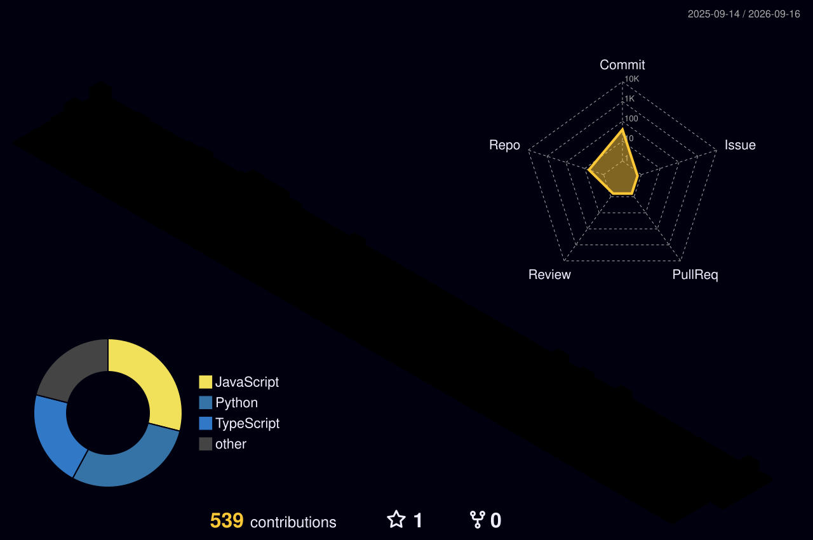

&nbsp;

---

Dual degree at IIT Kharagpur, writing backend and AI infrastructure. Currently on scalable RAG pipelines and a GSoC 2026 proposal for the Internet Archive.

<table>
<tr><td><b>Neosophical Labs</b></td><td>Full Stack Dev Intern</td><td align="right">May – Jul 2026</td></tr>
<tr><td><b>Datsol Solutions</b></td><td>Full Stack Dev Intern</td><td align="right">Nov 2025 – May 2026</td></tr>
<tr><td><b>10X Analysts</b></td><td>Backend Engineering Intern</td><td align="right">May – Jul 2025</td></tr>
<tr><td><b>Zyke</b></td><td>Founding Member</td><td align="right">Oct 2024 – Jan 2025</td></tr>
</table>

---

## Stack

 
 

  

---

## Contributions in 3D

---

## Work

**Consistent Hashing Load Balancer** &nbsp;·&nbsp; `Node` `Express` `Docker` `nginx`

> Hash ring written from scratch: 32-bit MD5 keyspace, weighted virtual nodes, `O(log R)` lookup.
> Node failure remaps **19.66%** of keys against ~80% for naive modulo.
> Chased a proxy regression to one missing keep-alive agent: **2,459ms → 1.6ms**, errors **3.7% → 0**.

**Zyke** &nbsp;·&nbsp; [zyke.in](https://zyke.in/) &nbsp;·&nbsp; `Flask` `MongoDB` `FLUX 1.1 Pro`

> An agent read a brand's site, ranked live trends against that voice, and shipped finished posts.
> Metered spend across **7 providers** so a post cost **$0.05**. One trend → **9 posts, 13 images, 4 min**.
> Archived. Ran on $50k+ in credits, never took cash.

**Membition** &nbsp;·&nbsp; `Next.js` `Flask` `Pinecone` `OpenAI`

> Client work. A **7-step form** and one PDF become a live hosted NGO chatbot in a single request.
> Dedicated Pinecone index per tenant, chunked 2,000/100, `gpt-4o-mini` scoped by 13 rules.

**Megalith 2025** &nbsp;·&nbsp; `Next.js` `TypeScript` `MongoDB`

> Site for IIT Kharagpur's civil engineering fest. **42.7% YoY** growth, 5K+ concurrent at peak.
> `jose` in Edge Middleware where Node crypto isn't available.

---

